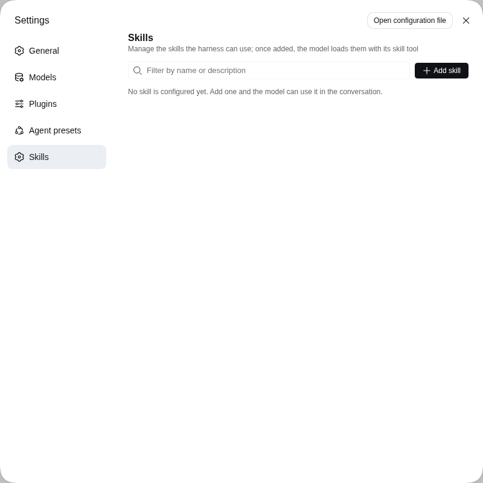
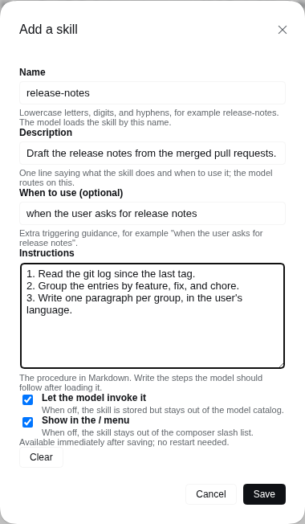
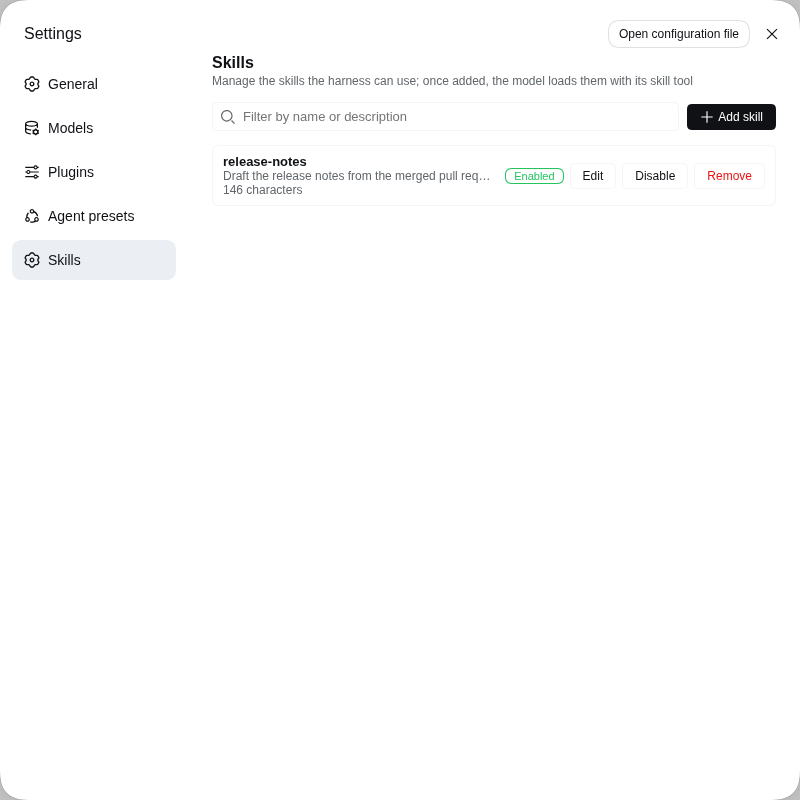

# dsh-skills-manager

[English](README.md) | 中文

一个 **非官方** 的 DeepSeek Harness 插件，用来管理
[技能（Agent Skills）](https://deepseek-harness.github.io/deepseek-harness/)：
在网页设置卡片或对话中新增、编辑、启用和删除技能，harness 会用它自带的
`skill` 工具把技能加载给模型。

> 本项目与 DeepSeek 没有隶属、背书或支持关系。署名见 [NOTICE.md](NOTICE.md)，
> 授权条款见 [LICENSE](LICENSE)。

## 它能做什么

- 维护一份技能清单，并通过一个 `ctx.skills` provider 发布出去，和 harness 自带的
  文件系统 provider 走同一个接口。
- 让每个启用的技能都能被 harness 自带的 `skill` 工具加载：模型会在会话技能目录里
  看到它，并像读取磁盘上的 `SKILL.md` 一样读取它的正文。从网页添加的技能是一等
  技能，而不是插件私有的清单条目。
- 不用改 YAML、不用重启，就能新增、编辑、删除、启用和停用技能。
- 为不熟悉配置文件的用户提供一个网页表单。

## 环境要求

- 已安装带 `dsh` 命令的 DeepSeek Harness，版本 `0.1.5-rc.2` 或兼容版本。插件把它
  接入的 harness 包声明为 peer 依赖（`@deepseek-ai/dsh-skill`、`dsh-settings`、
  `dsh-tools`、`dsh-util-values`、`@deepseek-ai/cordis`）；安装到的 profile 必须
  已经提供这些包，官方自带的 `web` profile 满足条件。
- 安装时需要联网，让 npm 解析这些 peer 依赖。

## 安装

```sh
dsh plugin --profile web add @ctl456/dsh-skills-manager
dsh --profile web
```

任何 profile 都可用；`web` 是带网页界面的那个。卸载：

```sh
dsh plugin --profile web remove @ctl456/dsh-skills-manager
```

如果要从打包好的 tarball 或本地代码安装：

```sh
npm pack                                   # 生成 dsh-skills-manager-<version>.tgz
dsh plugin --profile web add file:/绝对路径/dsh-skills-manager-0.1.0.tgz
```

## 在网页界面里使用

打开 **设置 → 技能（Skills）**，它是设置导航里独立的一页，位于 **Agent 预设**
下方。



| 字段 | 含义 |
|---|---|
| 名称 | 技能的标识：小写字母、数字和单个连字符，最长 64 个字符。模型用这个名字调用技能。 |
| 描述 | 一句话说明这个技能做什么、什么时候用；模型据此决定是否加载。 |
| 何时使用（可选） | 补充触发场景，例如“当用户要求整理发布说明时”。 |
| 技能内容 | Markdown 格式的操作说明。写清模型加载后要照着做的步骤。 |
| 允许模型自动调用 | 关闭后技能仍会保存，但不会出现在模型的技能目录里。 |
| 允许用 / 唤出 | 关闭后技能不会出现在输入框的 / 技能列表中。 |

点 **添加技能** 会弹出卡片式对话框。填好按 **保存** 后立即生效，无需重启。



页面会列出所有已配置技能及其描述、大小、启用状态，以及 **编辑**、
**启用/停用** 和 **删除** 按钮。名称重复时会覆盖原有条目。列表每页显示 5 条，
搜索框会同时匹配名称和描述。



## 在对话里管理技能

`skills_manager_list` 读取当前清单；`skills_manager_add`、
`skills_manager_remove` 和 `skills_manager_set_enabled` 修改它。每次调用都会返回
最新清单，包含每个技能的调用开关和校验问题，所以你可以直接让模型帮你添加技能，
而不用自己填表。

## 配置保存在哪里

网页卡片和模型工具编辑的是 `$DSH_HOME/settings.yaml` 里同一个 `skills-manager`
配置节。`cordis.patch.yml` 里的 `skills` 数组是组合配置的 base 层，因此 profile 或
`--patch` 覆盖层可以预置技能，而最终生效的始终是设置文档里的值。

## 限制

- 一个受管技能就是一段 Markdown 正文。打包资源（脚本、模板、参考文件）不在这个
  注册表范围内，这类技能请继续使用磁盘上的 `SKILL.md` 目录。
- 技能正文以普通设置值保存，请不要把密钥写进去。

## 重新构建打包产物

`lib/` 和 `src/` 需要在 DeepSeek Harness 源码仓库里构建，因为上游构建链和工作区
耦合：host 产物来自仓库根目录的 `tsdown` 配置和 Typert 代码生成插件，浏览器产物
来自 `packages/client/tsdown.client.ts` 及其辅助模块。因此不支持在本仓库独立构建。

```sh
git clone https://github.com/deepseek-ai/deepseek-harness
cd deepseek-harness && pnpm install && pnpm run build
cd /path/to/dsh-skills-manager
scripts/sync-from-harness.sh /path/to/deepseek-harness
```

该脚本会刷新 `lib/`、`src/` 和 `cordis.patch.yml`，重新套用本仓库的包名，并把
harness 版本与提交写入 `PROVENANCE.md`。

## 发布前的验证

```sh
npm run verify:install
```

它会打包 tarball、检查内容、用 `dsh plugin add file:<tarball>` 安装到一个临时
profile，并确认组合后的 profile 树里包含 `skills-manager` 这一行。这一步用来区分
“用 `link:` 挂本地代码能跑”和“用户按标准方式安装能跑”。

## 发布

`package.json` 里的 `version`、`v<version>` git tag 和 `CHANGELOG.md` 顶部这一节
必须一致；推送 tag 会触发 `.github/workflows/release.yml`，当该版本尚未发布时
发布到 npm，并创建 GitHub Release。完整流程（tag 规则、发布清单、npm token 配置）
见 [RELEASING.zh.md](RELEASING.zh.md)。

## 授权

MIT，保留上游版权声明——见 [LICENSE](LICENSE) 和 [NOTICE.md](NOTICE.md)。
